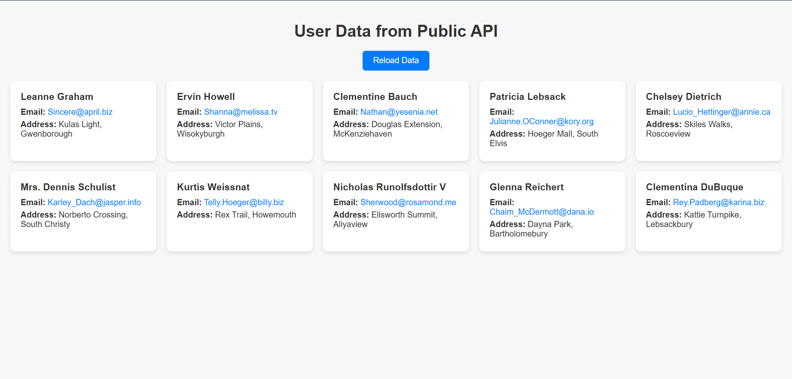
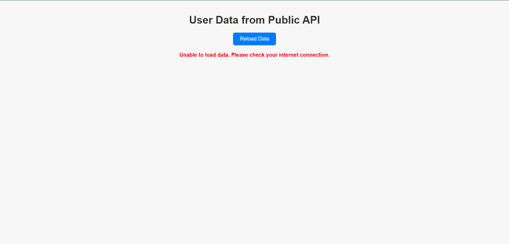

# Fetch-User-Data 

## Objective
Using JavaScript Fetch API to retrieve user data from a public API and display it on a responsive webpage.

---

## Tools
- VS Code (or any code editor)
- Chrome Browser (or any modern browser)

---

📁 Project Structure
```
fetch-user-data/
│── assets/
|   ├── user-list-loaded.png
|   └──user-error-state.png
│── index.html
│── script.js
└── style.css
```
---

## 📝 Features
- Fetches user data from [https://jsonplaceholder.typicode.com/users](https://jsonplaceholder.typicode.com/users)
- Shows each user’s name, email, and address (street, city) inside cards
- Displays a loading message while fetching data
- Handles and shows error messages on network/API failure or offline detection
- Includes a reload button to refresh the data
- Responsive layout using CSS grid/flexbox with modern styling

---

## 📷 Screenshots

| user-list-loaded               |  user-error-state                  |
|-----------------------------|------------------------------|
|  |    |

---

## ⚙️ How To Run
1. Clone or download this repo.
2. Open it in your editor.
3. Open `index.html` in the browser.
4. Click "Reload Data" to fetch user info anytime.

---
